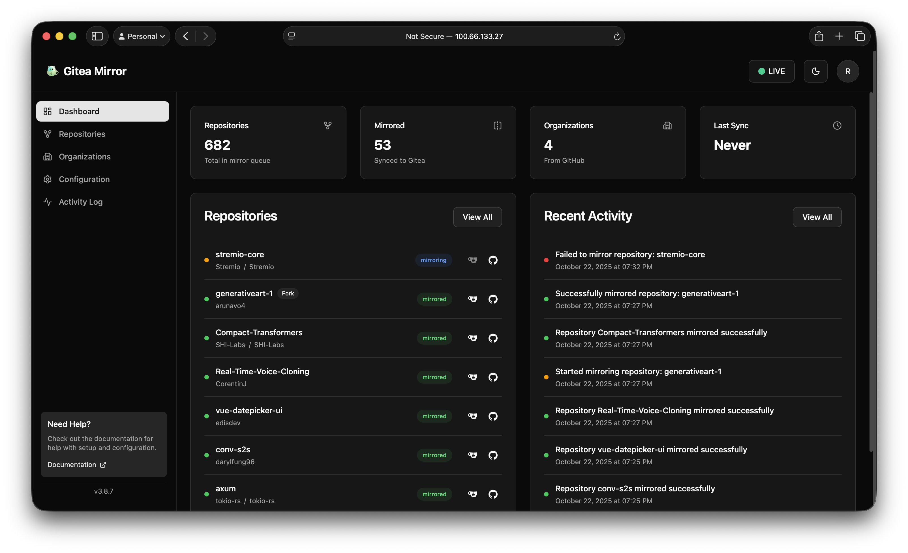
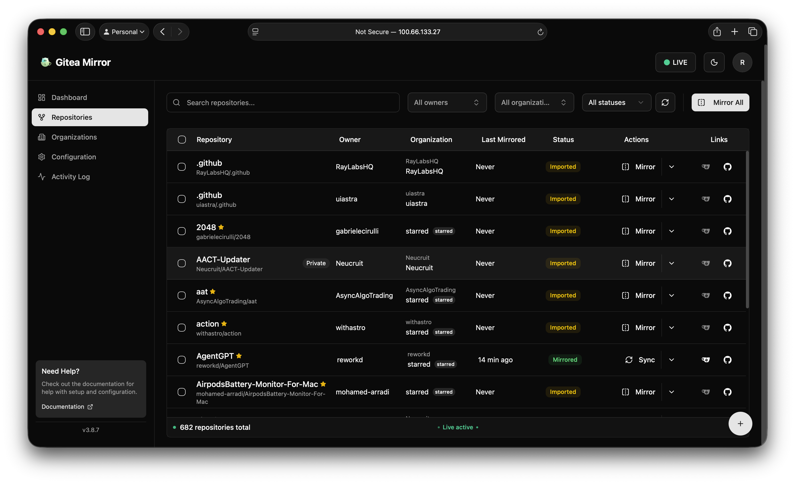

<p align="center">
  
  <h1>Gitea Mirror</h1>
  <p><i>Automatically mirror repositories from GitHub to your self-hosted Gitea instance.</i></p>
  <p align="center">
    <a href="https://github.com/arunavo4/gitea-mirror/releases/latest"></a>
    <a href="https://github.com/arunavo4/gitea-mirror/actions/workflows/astro-build-test.yml"></a>
    <a href="https://github.com/arunavo4/gitea-mirror/pkgs/container/gitea-mirror"></a>
    <a href="https://github.com/arunavo4/gitea-mirror/blob/main/LICENSE"></a>
  </p>
</p>

## 🚀 Quick Start

```bash
# Using Docker (recommended)
docker compose up -d

# Access at http://localhost:4321
```

First user signup becomes admin. No configuration needed to get started!

<p align="center">
  
</p>

## ✨ Features

- 🔁 Mirror public, private, and starred GitHub repos to Gitea
- 🏢 Mirror entire organizations with flexible strategies
- 🎯 Custom destination control for repos and organizations
- 🔐 Multiple auth methods with UI setup: Local, OIDC/SSO, Forward Auth
- 📊 Real-time dashboard with activity logs
- ⏱️ Scheduled automatic mirroring
- 🐳 Dockerized with multi-arch support (AMD64/ARM64)

## 📸 Screenshots

<p align="center">
  
  
</p>

## Installation

### Docker (Recommended)

```bash
# Clone repository
git clone https://github.com/arunavo4/gitea-mirror.git
cd gitea-mirror

# Start with Docker Compose
docker compose up -d

# Access at http://localhost:4321
```

### Configuration Options

Authentication can be configured through the UI during initial setup! You can also pre-configure using environment variables:

```bash
# Create a .env file for custom settings (optional)

# Pre-configure authentication method (or use UI setup wizard)
AUTH_METHOD=local              # Options: local, oidc, forward

# OIDC/SSO Configuration (can be set via UI)
AUTH_OIDC_ISSUER_URL=https://your-provider.com/application/o/gitea-mirror/
AUTH_OIDC_CLIENT_ID=gitea-mirror
AUTH_OIDC_CLIENT_SECRET=your-secret

# Forward Auth (can be set via UI)
AUTH_FORWARD_TRUSTED_PROXIES=10.0.0.1,10.0.0.2
```

See [Authentication Guide](docs/authentication-guide.md) for detailed SSO setup with Authentik, Keycloak, etc.

### LXC Container (Proxmox)

```bash
# One-line install on Proxmox VE
bash -c "$(curl -fsSL https://raw.githubusercontent.com/community-scripts/ProxmoxVE/main/ct/gitea-mirror.sh)"
```

See the [Proxmox VE Community Scripts](https://community-scripts.github.io/ProxmoxVE/scripts?id=gitea-mirror) for more details.

### Manual Installation

```bash
# Install Bun
curl -fsSL https://bun.sh/install | bash

# Setup and run
bun run setup
bun run dev
```

## Usage

1. **First Time Setup**
   - Navigate to http://localhost:4321
   - Choose authentication method via setup wizard
   - Create admin account (first user)
   - Configure GitHub and Gitea connections

2. **Mirror Strategies**
   - **Preserve Structure**: Maintains GitHub organization structure
   - **Single Organization**: All repos go to one Gitea organization
   - **Flat User**: All repos under your Gitea user account
   - **Mixed Mode**: Personal repos in one org, organization repos preserve structure

3. **Customization**
   - Click edit buttons on organization cards to set custom destinations
   - Override individual repository destinations in the table view
   - Starred repositories automatically go to a dedicated organization

## Development

```bash
# Install dependencies
bun install

# Run development server
bun run dev

# Run tests
bun test

# Build for production
bun run build
```

## Technologies

- **Frontend**: Astro, React, Shadcn UI, Tailwind CSS v4
- **Backend**: Bun runtime, SQLite, Drizzle ORM
- **APIs**: GitHub (Octokit), Gitea REST API
- **Auth**: JWT, OIDC/OAuth2, Forward Auth headers

## Contributing

Contributions welcome! Please submit a Pull Request.

## License

MIT License - see [LICENSE](LICENSE) file for details.

## Support

- 📖 [Documentation](https://github.com/arunavo4/gitea-mirror/tree/main/docs)
- 🐛 [Report Issues](https://github.com/arunavo4/gitea-mirror/issues)
- 💬 [Discussions](https://github.com/arunavo4/gitea-mirror/discussions)
- 🐧 [Proxmox VE Script](https://community-scripts.github.io/ProxmoxVE/scripts?id=gitea-mirror)
