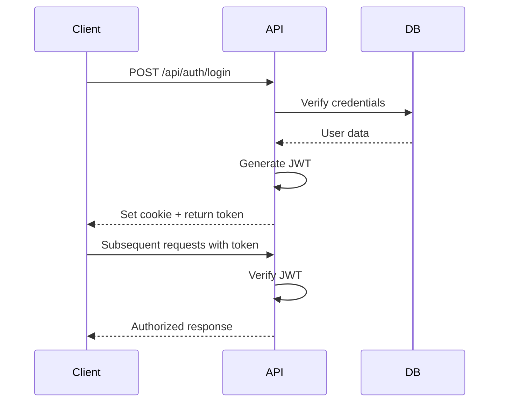
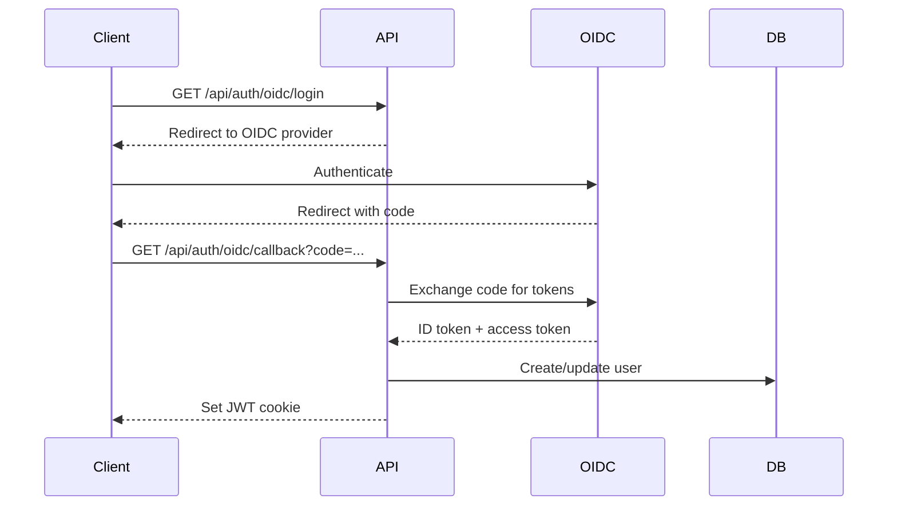
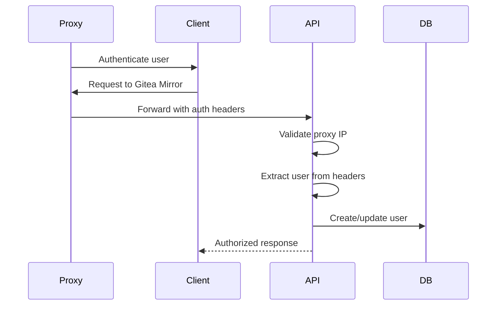

# System Internals

This document covers the internal workings of Gitea Mirror for advanced users and maintainers.

## Table of Contents
- [Database Schema](#database-schema)
- [Authentication Flow](#authentication-flow)
- [Mirror Process](#mirror-process)
- [Recovery & Resilience](#recovery--resilience)
- [Performance Optimizations](#performance-optimizations)

## Database Schema

### Core Tables

```sql
-- Users table
users (
  id TEXT PRIMARY KEY,
  username TEXT UNIQUE NOT NULL,
  password TEXT,  -- Optional for external auth
  email TEXT NOT NULL,
  displayName TEXT,
  authProvider TEXT DEFAULT 'local',
  externalId TEXT,
  isActive BOOLEAN DEFAULT true,
  lastLoginAt TIMESTAMP,
  createdAt TIMESTAMP DEFAULT CURRENT_TIMESTAMP
)

-- Configurations
configs (
  id TEXT PRIMARY KEY,
  userId TEXT REFERENCES users(id),
  name TEXT NOT NULL,
  githubConfig JSON,
  giteaConfig JSON,
  scheduleConfig JSON,
  isActive BOOLEAN DEFAULT true
)

-- Repositories
repositories (
  id TEXT PRIMARY KEY,
  userId TEXT REFERENCES users(id),
  configId TEXT REFERENCES configs(id),
  fullName TEXT NOT NULL,
  organization TEXT,
  status TEXT DEFAULT 'imported',
  mirroredLocation TEXT,
  destinationOrg TEXT,  -- Custom destination
  isStarred BOOLEAN DEFAULT false,
  lastMirrored TIMESTAMP,
  errorMessage TEXT
)

-- Mirror Jobs (with recovery support)
mirror_jobs (
  id TEXT PRIMARY KEY,
  batchId TEXT,
  jobType TEXT DEFAULT 'mirror',
  status TEXT DEFAULT 'pending',
  totalItems INTEGER,
  completedItems INTEGER DEFAULT 0,
  inProgress BOOLEAN DEFAULT false,
  startedAt TIMESTAMP,
  completedAt TIMESTAMP,
  lastCheckpoint TIMESTAMP
)
```

### Indexes for Performance

```sql
CREATE INDEX idx_repos_user_status ON repositories(userId, status);
CREATE INDEX idx_repos_config ON repositories(configId);
CREATE INDEX idx_jobs_batch ON mirror_jobs(batchId);
CREATE INDEX idx_jobs_status ON mirror_jobs(status, inProgress);
CREATE INDEX idx_events_user_channel ON events(userId, channel);
```

## Authentication Flow

### Local Authentication



### OIDC Flow



### Forward Auth Flow



## Mirror Process

### Repository Discovery

```typescript
async function discoverRepositories(config: Config) {
  // 1. Fetch from GitHub
  const repos = await octokit.repos.listForAuthenticatedUser({
    per_page: 100,
    affiliation: 'owner,collaborator,organization_member'
  });

  // 2. Apply filters
  const filtered = repos.filter(repo => {
    if (config.skipForks && repo.fork) return false;
    if (!config.privateRepos && repo.private) return false;
    return matchesIncludeExclude(repo.name, config);
  });

  // 3. Store in database
  for (const repo of filtered) {
    await db.insert(repositories).values({
      id: generateId(),
      fullName: repo.full_name,
      status: 'imported',
      // ... other fields
    });
  }
}
```

### Mirror Execution

```typescript
async function mirrorRepository(repo: Repository, config: Config) {
  try {
    // 1. Determine destination
    const owner = await getGiteaRepoOwnerAsync({ config, repository: repo });
    
    // 2. Create/update in Gitea
    const giteaRepo = await createOrUpdateGiteaRepo({
      name: repo.name,
      owner,
      private: repo.isPrivate,
      mirror: true,
      mirror_address: repo.cloneUrl,
      mirror_username: config.githubUsername,
      mirror_password: config.githubToken
    });

    // 3. Update status
    await db.update(repositories)
      .set({ 
        status: 'mirrored',
        mirroredLocation: `${owner}/${repo.name}`,
        lastMirrored: new Date()
      })
      .where(eq(repositories.id, repo.id));

  } catch (error) {
    await handleMirrorError(repo, error);
  }
}
```

### Destination Resolution

Priority order for determining where a repository goes:

1. **Starred repos** → `starredReposOrg` (highest priority)
2. **Repository override** → `repository.destinationOrg`
3. **Organization override** → `organization.destinationOrg`
4. **Personal repos override** → `config.personalReposOrg`
5. **Strategy rules** → Based on selected mirror strategy

## Recovery & Resilience

### Job Recovery System

The system can recover from interruptions (crashes, restarts, etc.):

```typescript
async function recoverInterruptedJobs() {
  // 1. Find interrupted jobs
  const stuckJobs = await db
    .select()
    .from(mirrorJobs)
    .where(
      and(
        eq(mirrorJobs.inProgress, true),
        lt(mirrorJobs.lastCheckpoint, new Date(Date.now() - 5 * 60 * 1000))
      )
    );

  // 2. Resume each job
  for (const job of stuckJobs) {
    const completed = JSON.parse(job.completedItemIds || '[]');
    const remaining = JSON.parse(job.itemIds || '[]')
      .filter(id => !completed.includes(id));

    await resumeMirrorJob(job, remaining);
  }
}
```

### Graceful Shutdown

```typescript
// Signal handlers
process.on('SIGTERM', gracefulShutdown);
process.on('SIGINT', gracefulShutdown);

async function gracefulShutdown() {
  console.log('Shutting down gracefully...');
  
  // 1. Stop accepting new jobs
  stopScheduler();
  
  // 2. Save job progress
  await saveAllJobProgress();
  
  // 3. Close database connections
  await db.close();
  
  process.exit(0);
}
```

### Error Recovery Strategies

1. **Exponential Backoff**
   ```typescript
   async function retryWithBackoff(fn: Function, maxRetries = 3) {
     for (let i = 0; i < maxRetries; i++) {
       try {
         return await fn();
       } catch (error) {
         if (i === maxRetries - 1) throw error;
         await sleep(Math.pow(2, i) * 1000);
       }
     }
   }
   ```

2. **Circuit Breaker**
   ```typescript
   class CircuitBreaker {
     private failures = 0;
     private lastFailure = 0;
     private state: 'closed' | 'open' | 'half-open' = 'closed';

     async call(fn: Function) {
       if (this.state === 'open') {
         if (Date.now() - this.lastFailure > 60000) {
           this.state = 'half-open';
         } else {
           throw new Error('Circuit breaker is open');
         }
       }

       try {
         const result = await fn();
         this.onSuccess();
         return result;
       } catch (error) {
         this.onFailure();
         throw error;
       }
     }
   }
   ```

## Performance Optimizations

### Database Optimizations

1. **Connection Pooling**
   ```typescript
   const db = new Database('data/gitea-mirror.db', {
     wal: true,  // Write-Ahead Logging
     synchronous: 'normal',
     cache_size: 10000,
     busy_timeout: 5000
   });
   ```

2. **Batch Operations**
   ```typescript
   // Insert multiple records efficiently
   await db.transaction(async (tx) => {
     const stmt = tx.prepare(
       'INSERT INTO repositories (id, name, status) VALUES (?, ?, ?)'
     );
     
     for (const repo of repos) {
       stmt.run(repo.id, repo.name, 'imported');
     }
   });
   ```

3. **Query Optimization**
   ```typescript
   // Use covering indexes
   await db.exec(`
     CREATE INDEX idx_repos_covering 
     ON repositories(userId, status) 
     INCLUDE (name, mirroredLocation)
   `);
   ```

### API Rate Limiting

```typescript
class RateLimiter {
  private queue: Function[] = [];
  private processing = false;

  async add<T>(fn: () => Promise<T>): Promise<T> {
    return new Promise((resolve, reject) => {
      this.queue.push(async () => {
        try {
          resolve(await fn());
        } catch (error) {
          reject(error);
        }
      });
      
      if (!this.processing) {
        this.process();
      }
    });
  }

  private async process() {
    this.processing = true;
    
    while (this.queue.length > 0) {
      const fn = this.queue.shift();
      await fn();
      await sleep(1000); // 1 request per second
    }
    
    this.processing = false;
  }
}
```

### Memory Management

1. **Stream Processing**
   ```typescript
   // Process large datasets in chunks
   async function* getRepositoriesInBatches(userId: string) {
     let offset = 0;
     const limit = 100;

     while (true) {
       const batch = await db
         .select()
         .from(repositories)
         .where(eq(repositories.userId, userId))
         .limit(limit)
         .offset(offset);

       if (batch.length === 0) break;

       yield batch;
       offset += limit;
     }
   }
   ```

2. **Cleanup Tasks**
   ```typescript
   // Automatic cleanup of old data
   async function cleanupOldEvents() {
     const thirtyDaysAgo = new Date();
     thirtyDaysAgo.setDate(thirtyDaysAgo.getDate() - 30);

     await db
       .delete(events)
       .where(lt(events.createdAt, thirtyDaysAgo));
   }
   ```

### Caching Strategy

```typescript
// In-memory cache with TTL
class Cache<T> {
  private cache = new Map<string, { value: T; expires: number }>();

  set(key: string, value: T, ttl: number = 300000) {
    this.cache.set(key, {
      value,
      expires: Date.now() + ttl
    });
  }

  get(key: string): T | undefined {
    const item = this.cache.get(key);
    if (!item) return undefined;
    
    if (Date.now() > item.expires) {
      this.cache.delete(key);
      return undefined;
    }
    
    return item.value;
  }
}

// Usage
const configCache = new Cache<Config>();
```

## Monitoring & Observability

### Health Checks

```typescript
// /api/health endpoint
export async function getHealthStatus() {
  const checks = {
    database: await checkDatabase(),
    github: await checkGitHubAPI(),
    gitea: await checkGiteaAPI(),
    jobs: await checkJobQueue()
  };

  const healthy = Object.values(checks).every(c => c.status === 'ok');

  return {
    status: healthy ? 'healthy' : 'unhealthy',
    checks,
    version: process.env.npm_package_version,
    uptime: process.uptime()
  };
}
```

### Metrics Collection

```typescript
class Metrics {
  private counters = new Map<string, number>();
  private timers = new Map<string, number[]>();

  increment(name: string, value = 1) {
    this.counters.set(name, (this.counters.get(name) || 0) + value);
  }

  timing(name: string, duration: number) {
    const times = this.timers.get(name) || [];
    times.push(duration);
    this.timers.set(name, times);
  }

  getMetrics() {
    const metrics: any = {};
    
    // Counters
    for (const [name, value] of this.counters) {
      metrics[name] = value;
    }
    
    // Timings
    for (const [name, times] of this.timers) {
      metrics[`${name}_avg`] = times.reduce((a, b) => a + b, 0) / times.length;
      metrics[`${name}_p95`] = percentile(times, 0.95);
    }
    
    return metrics;
  }
}
```

## Security Considerations

### Input Validation

All user inputs are validated using Zod schemas:

```typescript
const mirrorRequestSchema = z.object({
  repositoryIds: z.array(z.string().uuid()),
  force: z.boolean().optional()
});

export async function handleMirrorRequest(data: unknown) {
  const validated = mirrorRequestSchema.parse(data);
  // Proceed with validated data
}
```

### SQL Injection Prevention

Using parameterized queries with Drizzle ORM:

```typescript
// Safe
await db.select().from(users).where(eq(users.id, userId));

// Never do string concatenation
// BAD: `SELECT * FROM users WHERE id = '${userId}'`
```

### XSS Prevention

React automatically escapes content, but be careful with:

```typescript
// Dangerous
<div dangerouslySetInnerHTML={{ __html: userContent }} />

// Safe
<div>{userContent}</div>
```

## Troubleshooting Guide

### Common Issues

1. **Database Locked**
   - Check for multiple processes
   - Enable WAL mode
   - Increase busy timeout

2. **Memory Leaks**
   - Monitor with `process.memoryUsage()`
   - Check for circular references
   - Ensure event listeners are cleaned up

3. **Slow Queries**
   - Run `EXPLAIN QUERY PLAN`
   - Add appropriate indexes
   - Consider denormalization

### Debug Mode

Enable detailed logging:

```bash
DEBUG=* bun run dev
```

Add debug points:

```typescript
if (process.env.DEBUG) {
  console.time('mirror-operation');
  // ... operation
  console.timeEnd('mirror-operation');
}
```

For more information, see the [Developer Guide](./DEVELOPER_GUIDE.md) and [User Guide](./USER_GUIDE.md).